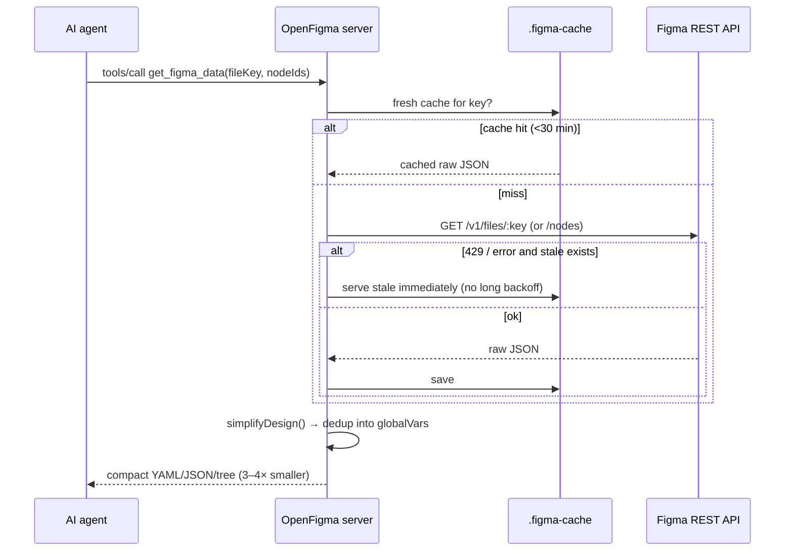
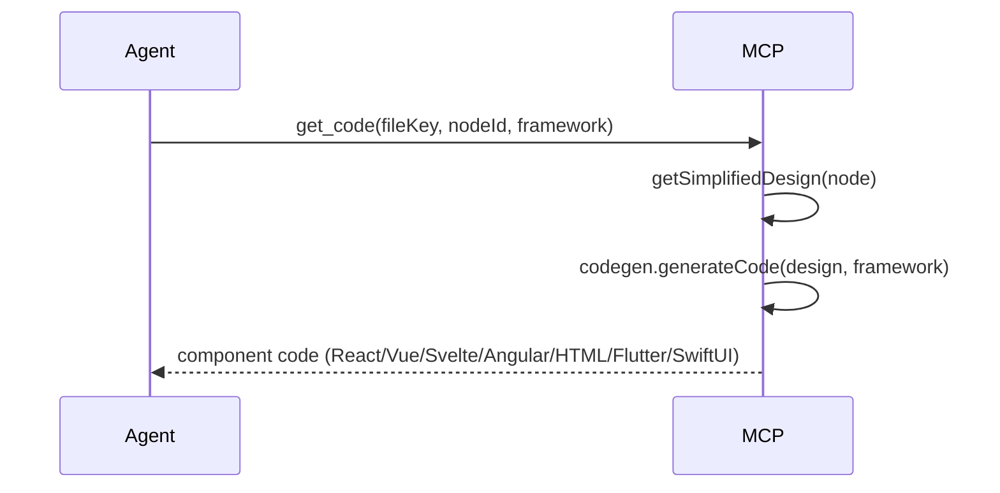
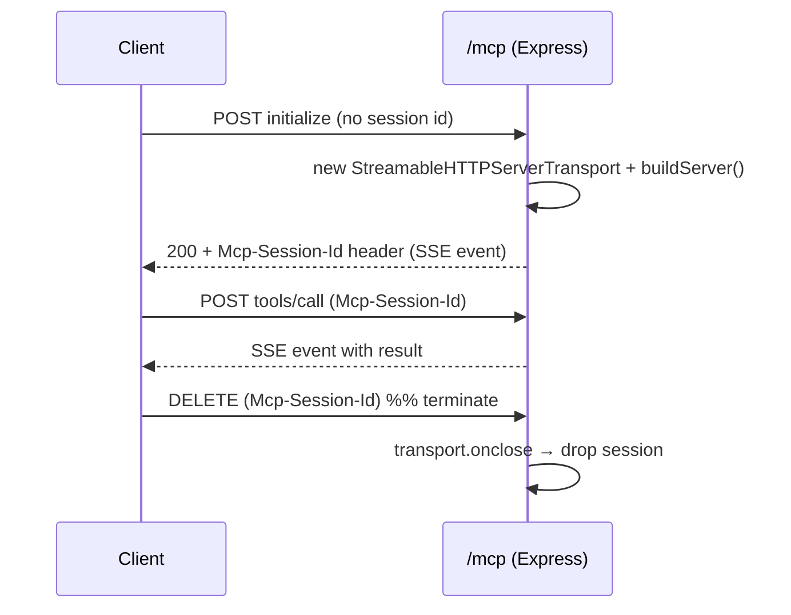

# OpenFigma MCP — Architecture & Working Mechanism

A deep, honest explanation of **how OpenFigma works**, **how the official Figma
MCP works**, and exactly where they overlap and differ. If you read one doc to
understand this project, read this one.

---

## 1. The 30-second mental model

An **MCP server** is a small program that exposes "tools" (functions) to an AI
agent (Cursor, Claude, VS Code, Lovable…) over the **Model Context Protocol**.
The agent calls a tool like `get_figma_data` or `create_frame`; the server does
the work and returns a result.

OpenFigma does the work in two ways:

1. **Reading** designs → via the **Figma REST API** with a free Personal Access
   Token (no paid Dev seat).
2. **Writing** to the canvas → via a **companion Figma plugin** that runs inside
   Figma and talks to the server over a local **WebSocket bridge** (the REST API
   cannot write to the canvas; the Plugin API can).

```
                         ┌─────────────────────────── your machine ───────────────────────────┐
   AI agent / editor     │   OpenFigma MCP server (Node)            Figma desktop app           │
  (Cursor, Claude,       │  ┌───────────────────────┐         ┌───────────────────────────┐   │
   VS Code, Lovable) ◄───┼──┤ MCP transport layer    │         │  OpenFigma Bridge plugin   │   │
        │   MCP          │  │  • stdio                │         │  (Plugin API: read/write) │   │
        │  (tools)       │  │  • Streamable HTTP /mcp │         └───────────▲───────────────┘   │
        ▼                │  │  • legacy SSE /sse      │                     │ WebSocket          │
   tool call ───────────┼─►│ tools ─► REST client ───┼──► Figma REST API   │ (:3846)            │
                         │  │       └─► WS bridge ────┼─────────────────────┘                    │
                         │  └───────────────────────┘                                            │
                         └────────────────────────────────────────────────────────────────────┘
```

---

## 2. How the OFFICIAL Figma MCP works (researched)

Figma ships an MCP server in two forms (per Figma's developer docs):

### a) Dev Mode MCP server (local)
- Runs **inside the Figma desktop app** (enable it in *Preferences → Enable Dev
  Mode MCP server*). It listens locally (historically `http://127.0.0.1:3845/sse`).
- Because it runs inside Figma, it has access to the **Plugin API**, so it can
  both **read** the file and **write native content to the canvas** (frames,
  components, variables, auto-layout).
- It is **selection-driven**: tools like `get_code`, `get_metadata`,
  `get_variable_defs`, `get_image` operate on the **currently selected frame**.
- **Paid / gated**: needs a Dev or Full seat; free/Starter/View seats are capped
  (publicly reported as ~6 tool calls/month).

### b) Remote MCP server (hosted, recommended by Figma)
- Connects directly to Figma's hosted endpoint — no desktop app needed. Uses
  **Streamable HTTP**. Provides the broadest feature set, including writing to
  the canvas with "skills."

### Official tool surface (functional pillars, from Figma's docs)
| Tool | Purpose |
|---|---|
| `get_code` | Generate code from the selected frame (React-ish) |
| `get_metadata` | Compact structural representation of the selection (ids/types/positions) |
| `get_variable_defs` | Variables & styles used by the selection |
| `get_image` | Render an image of the selection |
| `get_code_connect_map` | Code Connect component→code mappings |
| `create_design_system_rules` | Generate a design-system rules file for the repo |
| *write tools* | Create/modify frames, components, variables, auto-layout (Plugin/Make API) |

**Key insight:** the official server's superpower is that it lives *inside*
Figma, giving it the Plugin API for canvas writes. Its weaknesses are **cost**,
**heavy token payloads** (a single screen has been measured at ~350k tokens),
and being **React-centric**.

---

## 3. How OPENFIGMA works

OpenFigma is a standalone Node server that reaches Figma two ways:

- **REST API + PAT** for everything readable (files, nodes, variables, comments,
  versions, images, components/styles, projects). Free, no Dev seat.
- **Figma plugin + WebSocket bridge** for canvas writes (the Plugin API piece the
  REST API lacks).

It then adds a **simplification + derivation layer** the REST API doesn't give
you: compact design data, design tokens (8 formats), multi-framework codegen (8
targets), WCAG audit, version diff, design-vs-code drift, and inline-SVG
extraction.

### Why OpenFigma's payloads are 3–4× smaller
The raw Figma REST response is enormous and repetitive. The **simplification
pipeline** (`src/simplify.js`):
1. keeps only fields that matter for implementation (layout, fills, strokes,
   effects, text, radius, opacity, bbox);
2. normalizes them (autolayout → flexbox-like `layout`, paints → hex, etc.);
3. **deduplicates** repeated style objects into a `globalVars.styles` block and
   references them by id — so a button style used 50 times is stored once.

This is the single biggest practical advantage over feeding raw API JSON (or the
official server's verbose output) to an LLM.

---

## 4. Component map (every module)

```
open-figma-mcp/
├─ src/
│  ├─ server.js        Entry point: CLI subcommands, MCP tool registration,
│  │                   transports (stdio / Streamable HTTP / SSE), starts the bridge.
│  ├─ config.js        Config resolution (CLI > env > defaults), help text, version.
│  ├─ figma.js         Figma REST client: fetch file/nodes/variables/images/comments/
│  │                   versions/projects, disk cache, retry + fast stale fallback, URL parse.
│  ├─ simplify.js      Raw Figma JSON → compact SimplifiedDesign + globalVars dedup;
│  │                   prompt-injection scanning of untrusted design text.
│  ├─ serialize.js     Dependency-free YAML / JSON / "tree" serializers.
│  ├─ tokens.js        Design-token extraction + 8 export formats.
│  ├─ designRules.js   create_design_system_rules generator (from real tokens).
│  ├─ codegen.js       Multi-framework code generation (8 targets) + typed component API.
│  ├─ a11y.js          WCAG contrast + tap-target audit.
│  ├─ diff.js          Semantic diff between two design versions.
│  ├─ drift.js         Design tokens vs. repo colors (figmaOnly / codeOnly / nearMiss).
│  ├─ vectors.js       Inline-SVG icon extraction from path geometry.
│  ├─ bridge.js        WebSocket bridge to the Figma plugin (canvas read/write).
│  ├─ capabilities.js  Honest capability report (incl. live plugin status).
│  ├─ detector.js      Auto-detect where to save downloaded images.
│  ├─ rules.js         Writes LOVABLE.md / .cursorrules on startup.
│  └─ proxy.js         Corporate-proxy support for the built-in fetch.
├─ figma-plugin/       The companion plugin (runs INSIDE Figma):
│  ├─ manifest.json    Plugin manifest (networkAccess → the bridge).
│  ├─ code.js          Plugin main thread: executes Plugin-API commands.
│  └─ ui.html          Plugin iframe: holds the WebSocket, relays commands.
├─ desktop/            Electron + React control app (Home / Playground / Settings).
└─ tests/              unit.test.js (offline), bridge.test.js (WS), integration.js (stdio).
```

### Tool catalogue (what the agent can call)
- **Read & simplify:** `get_figma_data`, `get_metadata`, `get_design_context`, `get_variable_defs`, `get_figjam`, `get_libraries`, `search_design_system`, `whoami`, `get_comments`, `get_versions`, `get_image_fills`, `get_dev_resources`, `get_projects`.
- **Design → code:** `get_design_tokens`, `generate_code` / `get_code`, `generate_component_api`, `create_design_system_rules`, `extract_vectors`.
- **Quality:** `audit_accessibility`, `get_design_diff`, `audit_drift`.
- **Images:** `download_figma_images`, `download_assets`, `get_screenshot` / `get_image`.
- **Canvas read/write (plugin):** `get_canvas_selection`, `get_canvas_document`, `get_node_info`, `create_frame`, `create_rectangle`, `create_ellipse`, `create_text`, `set_fill_color`, `set_stroke_color`, `set_corner_radius`, `set_opacity`, `add_drop_shadow`, `set_image_fill`, `set_text`, `set_name`, `set_auto_layout`, `move_node`, `resize_node`, `clone_node`, `delete_node`, `group_nodes`, `create_component_from_node`, `create_instance`.
- **Meta:** `capabilities`, Code Connect toolchain.

---

## 5. Data flow (sequence diagrams)

### 5.1 Reading a design (`get_figma_data`)


### 5.2 Generating code (`generate_code` / `get_code`)


### 5.3 Writing to the canvas (`create_frame`, etc.) — the plugin path
```mermaid
sequenceDiagram
    participant Agent
    participant MCP as OpenFigma server
    participant Bridge as WS bridge (:3846)
    participant UI as Plugin UI (iframe)
    participant Main as Plugin main (Plugin API)
    Agent->>MCP: tools/call create_frame({x,y,w,h,fill})
    alt plugin connected
        MCP->>Bridge: sendCommand(id, "create_frame", params)
        Bridge->>UI: {type:command} over WebSocket
        UI->>Main: postMessage(command)
        Main->>Main: figma.createFrame(); set props; append
        Main-->>UI: {id, ok, result:{id,name,type}}
        UI-->>Bridge: {type:result} over WebSocket
        Bridge-->>MCP: resolve(result)
        MCP-->>Agent: created node info
    else plugin NOT connected
        MCP-->>Agent: { supported:false, reason:"open the plugin" }
    end
```

### 5.4 Streamable HTTP session lifecycle


---

## 6. Transports

OpenFigma speaks three MCP transports from one codebase. Each session gets its
own MCP server instance via a `buildServer()` factory (so concurrent Streamable
HTTP sessions are isolated), while the WebSocket bridge is a single process-wide
singleton shared by all sessions.

| Transport | Endpoint | Use it for |
|---|---|---|
| **stdio** | (process pipe) | Cursor, Claude Desktop, VS Code, Windsurf (command-based) |
| **Streamable HTTP** | `POST/GET /mcp` | Modern clients & Lovable (the recommended path) |
| **Legacy SSE** | `GET /sse` + `POST /messages` | Older SSE-only clients |

A per-request `X-Figma-Token` (or `Authorization: Bearer`) header overrides the
server's credentials for that request only — enabling shared/multi-user
deployments where no token lives on the host.

---

## 7. Caching & rate-limit strategy

Free Figma PATs are heavily rate-limited (429). OpenFigma is built to survive it:

- **Disk cache** (`.figma-cache/`), 30-minute TTL — repeated reads during a build
  session don't re-hit the API.
- **Fast stale fallback** — on a 429/error, if any cached copy exists it's served
  **immediately** (1 short attempt) instead of waiting through exponential backoff.
  This prevents client-side tool timeouts (the original cause of "tools keep
  failing" in Lovable).
- **Local node resolution** — `get_figma_data` for specific `nodeIds` resolves
  from a cached full-file tree when possible, avoiding extra calls.
- **Image fills via the light endpoint** — `get_image_fills` / `set_image_fill`
  use the image-fills/`createImageAsync` path, which doesn't consume the heavily
  throttled render quota.

---

## 8. Security model

- **No telemetry.** Nothing is collected or sent anywhere except Figma's API.
- **Localhost-first.** HTTP binds to `127.0.0.1` by default; the WS bridge is
  `127.0.0.1` only. If you bind HTTP to `0.0.0.0` for a shared deployment, the
  `/mcp` and `/sse` endpoints have **no built-in auth** — front them with a
  reverse proxy and use per-request `X-Figma-Token`. (See `SECURITY.md`.)
- **Untrusted design text.** Figma text is authored by anyone with file access,
  so the simplifier scans it for prompt-injection patterns and surfaces a
  `securityWarnings` block — design text is treated as data, never instructions.
- **Token hygiene.** Tokens come from flags/env/per-request headers and are never
  logged or written to disk.
- **Honesty layer.** Operations that can't really happen return a structured
  `supported:false` instead of fabricating success. `capabilities` reports the
  live truth, including whether the Figma plugin is connected.

---

## 9. Extending OpenFigma

| To add… | Do this |
|---|---|
| **A codegen framework** | Add `renderX()` in `codegen.js`, register in `CODEGEN_FRAMEWORKS` + the `generateCode` switch, add a test, update README. |
| **A token format** | Add `tokensToX()` in `tokens.js`, register in `TOKEN_FORMATS` + `formatTokens` switch, add a test. |
| **A read tool** | `server.tool(name, schema, handler)` in `buildServer()` using the `figma.js` client. |
| **A canvas command** | Add a `case` in `figma-plugin/code.js`, then a `server.tool(...)` calling `pluginCall('your_command', args)`. Add it to `capabilities.js`. |

The contract between server and plugin is a tiny JSON protocol:
`{ id, type:'command', command, params }` → `{ type:'result'|'error', id, result|error }`.

---

## 10. OpenFigma vs official — one-line recap

OpenFigma matches the official Figma MCP for **read + design-to-code + canvas
write** (the latter via its free plugin), is **free** (no Dev seat), produces
**3–4× smaller** payloads, supports **8 frameworks** and **8 token formats**, and
adds **a11y / diff / drift / inline-SVG** the official server doesn't. The only
things it deliberately doesn't do — creating brand-new *files*, and HTML/Mermaid→
canvas conversion — it reports honestly. Full table: [COMPARISON.md](COMPARISON.md).
